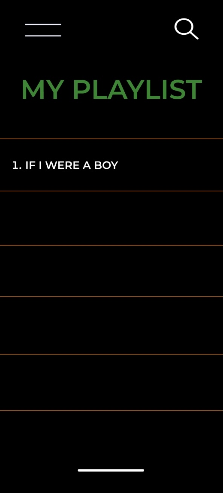

Group Milestone 1 - README 
===

# Musicly

## Table of Contents
1. [Overview](#Overview)
1. [Product Spec](#Product-Spec)
1. [Wireframes](#Wireframes)

## Overview
### Description
A service that connects people who love music by generating playlists full of songs they enjoy and new songs for the listener to experience. The user can save playlists that they want to keep and have access to playlists already generated.

### App Evaluation
- **Category:** Music
- **Story:** Users have the ability to find new music by genre, artist, then songs. The user can then decide to add the song to their playlist if they are a registered user, if not, they won't have these abilities. Or users can enjoy music they already know by generating an endless amount of playlist. 
- **Market:** Any individual who loves music could choose to use this app.
- **Habit:** This app could be used as often or unoften as the user wanted depending on what exactly they're looking for or how much the user want to listen music.
- **Scope:** First we would start with asking the user what type of genre they are interested in listening to, then we would list all artist based on that genre, and once an artist is choosen, a list of songs will appear with the choice of adding the song to their playlist. This application will allows users that love music to create and save a playlist they can listen to 24/7 or whenever they want. This could evolve into a music sharing application with playlists already created as well to broaden its usage. There is a large potential for use with other music streaming applications.

## Product Spec
### 1. User Stories (Required and Optional)

**Required Must-have Stories**

* User logs in to access playlist application. [Checked]
* User picks what their favorite artist/genre/songs. 
* User has the ability to add song to their playlist.
* "My Playlist" page for each user.

**Optional Nice-to-have Stories**

* Page of most downloaded/added songs.
* Page of top muisic choices.
* Optional Share Button.
* Settings (Accesibility, Notification, General, etc.)

### 2. Screens

* Login 
* Register - User signs up or logs into their account
* Home Screen - User can choose 'Create Playlist', 'My Playlist', or 'Settings'.
* Create Playlist 
   * Allows user to create playlist
    * Genre
    * Artist
    * Song
* My Playlist - Allows user to view their created playlist.
* Settings Screen
   * Lets people log out, and change app notification settings.

### 3. Navigation

**Tab Navigation** (Tab to Screen)

* Home
* Create Playlist
* My Playlist
* Settings

Optional:
* Top Songs

**Flow Navigation** (Screen to Screen)
* Forced Log-in -> Account creation if no log in is available
* Create Playlist -> Genre Selection -> Artist Selection -> Song Selection
* My Playlist -> Playlist Screen 
* Settings -> Toggle Settings

## Wireframes

     
### Digital Wireframes & Mockups

### [BONUS] Interactive Prototype

## Schema 
### Models
#### Post

   | Property      | Type     | Description |
   | ------------- | -------- | ------------|
   | userKey      | String   | Key for user |
   | Playlist        | Array| Array of songs |
   | Genre         | String    | Name of genres |
   | Artist       | Map  | Map containing information for artist |
   | song | File   | Audio file of song |
   |color    | String  | Hex color |
   
  
### Networking
#### List of network requests by screen
   - Home Feed Screen
      - (Create/POST) Create a new like on a song
      - (Delete) Delete existing songs off playlists
      - (Create/POST) Create a new playlist
      - (Delete) Delete existing album 
   - Profile Screen
      - (Read/GET) Query logged in user object
      
#### [IF EXISTS:] Existing API Endpoints
##### An API Of MUSIC
- Base URL - https://spotify23.p.rapidapi.com

   HTTP Verb | Endpoint | Description
   ----------|----------|------------
    `GET`    | /search | get music object
    `GET`    | /search/ids| get specific music object using id
    `GET`    | /artist   | get artist object
    `GET`    | /artists/ids   | get specific artist object using id
    `GET`    | /playlist | get available playlist
    `GET`    | /playlist/id | get specific playlist using PlaylistID 
    
    ### Milestone 3 (3/8/2022)
    
